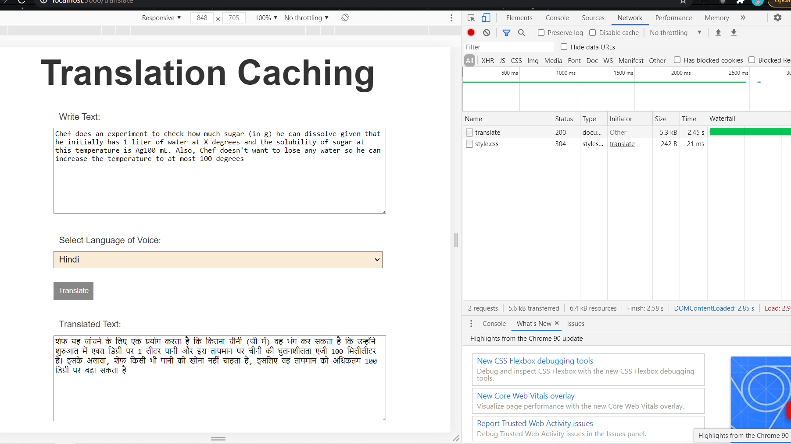
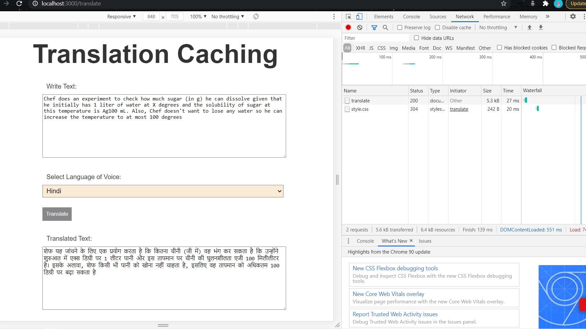
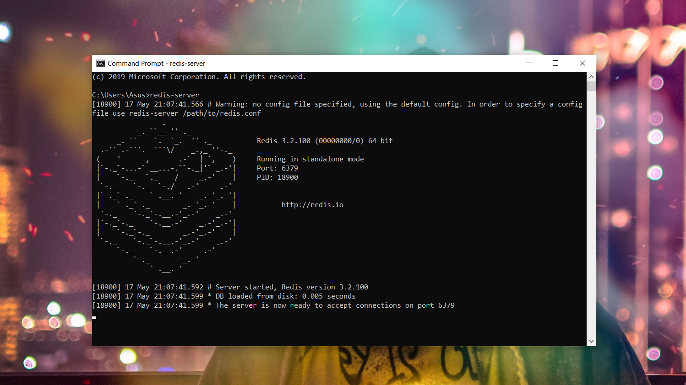

# Translation-Caching 📝


[](https://www.linkedin.com/in/shubham-anand-3a714a1a3/)

 ## Introduction🍫

 ---
A Web Server with a RESTful API to translate a text from one language to another

**Translation-Caching** is a web application developed on RESTful Routing using Node.JS, Express.JS, Embedded JavaScript (EJS) and more.:.😇🤘

## Request Response Time 🌠🌠
 ---
#### Fetching data for the first time takes **2.45s**


#### Fectching the same data now takes **27ms**  😊😇



<p align="center">*~~~*</p>

## Files Description 👓
---
* **app.js** is the main file that is the heart of our web application and contains the RESTful Routes defined for each event.
* **views** directory contains the relevant pages and parials, the EJS templates, that render on each event.
* **public/css** directory contains neccesary CSS used in web App
* **package.json** file contains the information towards the various dependencies and packages

## Setup and Running the Server/App
---
### 1. 🔰Clone the Repository

###### To make your own local copy of the repository you would like to contribute to, let’s first open up a terminal window(Command prompt).

###### We’ll use the `git clone` command along with the URL of the repository.

```
git clone https://github.com/Shubham0599/Translation-Caching.git
```

###### Now we have the copy of file in our computer (you can cross verify it by going to the location showing in Command Prompt)


### 2. 🔰Download Redis

###### This will act as local database for caching , which will help to reduce the time between request and response.

###### We can download it from -.

`https://github.com/dmajkic/redis/downloads`
###### Download the first zip and install it in your local windows environment.

### 3. 🔰Run Redis Server in background

###### after downloading redis zip ,extract it and run `redis-server`

###### let it run in the background 


### 4. 🔀Navigate to the repository folder and open it in VS Code or Teminal 

###### to run the project in your local environment we have to install all the dependencies first:

##### this can be done with a simple code 
`npm install`

### 5. 🔀Run the App in your localhost 

###### type `node <name_of_route_file>`
###### here
`node app.js`

---

## 👑 👑 Hurray!!! You have just run the App in your localhost. 😃